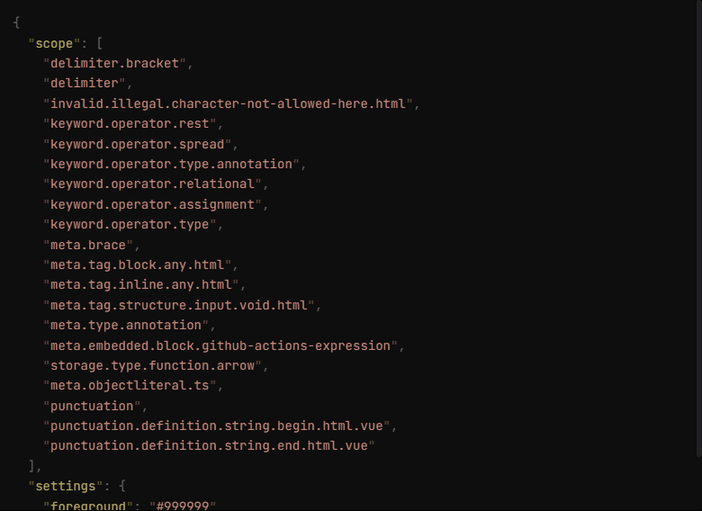

# zh-translator

> [!NOTE]
> 不翻译长句，只翻译单词，只支持 ESM，因为用了动态导入 [`import`](https://developer.mozilla.org/en-US/docs/Web/JavaScript/Reference/Operators/import)

仓库为 monorepo：

- npm 库：[zh-translator](/packages/zh-translator/)
- 浏览器插件：[@zh-translator/extension](/packages/extension/)

# 插件效果演示

# 感谢

- 数据来源： [vscode_english_chinese_dictionary](https://github.com/program-in-chinese/vscode_english_chinese_dictionary)
